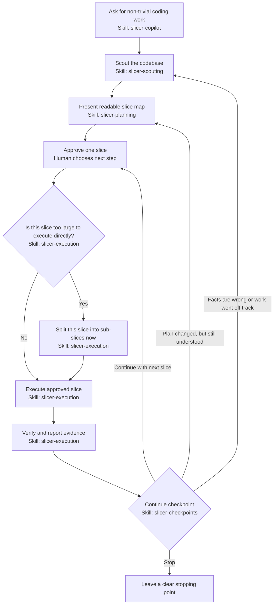

# Slicer Skills

Slicer Skills is a small set of workflow skills for developers who care about what happens to their code.

It is not trying to make an agent write more code at any cost. The point is quieter: make the agent slow down at the right moments, read before acting, split risky work into reviewable slices, and stop before it turns a clear task into a large surprise diff.

The skills are still at an early stage. Names, wording, and workflow details may change as the workflow is tested on real engineering tasks.

## Why This Exists

AI coding agents are useful, but they can make the wrong kind of progress very quickly.

The failure mode this project cares about most is not "the agent was too slow." It is:

- it changed too much at once;
- it guessed instead of reading the codebase;
- it moved responsibility across boundaries without saying so;
- it hid an architectural decision inside implementation;
- it skipped the test decision or wrote tests mechanically;
- it fixed a symptom without proving the root cause;
- it left the human to review one big diff after the important decisions were already made.

Slicer is for developers who are okay with agent help, but still want to protect the shape, ownership, and reviewability of their code.

## Main Idea: Slices

A slice is one coherent increment of work with clear boundaries.

Each slice should answer:

- what is the goal;
- what is included;
- what is explicitly not included;
- whether tests should be written and why;
- how the change will be verified;
- where the agent must stop before continuing.

For larger work, Slicer can split a slice into sub-slices when that slice is about to be executed. The first map should stay understandable. A parent slice is a milestone; a sub-slice is the smaller implementation step used when the milestone is still too large to review safely.

That is the core feature of this repository: the agent should not treat "make this refactor" as permission to do the whole thing in one pass. It should map the work, execute one approved slice, show evidence, and only then move on.

## Workflow

```text
scouting -> slice map -> approve one slice -> execute -> verify -> continue checkpoint -> next slice or back to scouting
```



In practice:

1. `slicer-scouting` makes the agent read the relevant code, tests, docs, logs, and patterns before proposing changes. It is read-only and ends at a context brief or approval checkpoint, not implementation.
2. `slicer-planning` turns the work into a readable slice map with boundaries, test decisions, verification, and stop conditions.
3. `slicer-execution` takes one approved slice. If that slice is still too large, it splits only that slice into sub-slices before editing code.
4. `slicer-checkpoints` is used at the continue point: continue to the next slice, revise the map, stop, or return to scouting if the assumptions were wrong.
5. `slicer-debugging` keeps bug work evidence-based: no edits before root cause and an approved fix route.

If a slice goes badly, the agent should not patch around confusion. It should go back to scouting, restate what changed, and rebuild the plan from the new facts.

## Example

Ask your coding agent to use Slicer before a risky change:

```text
Use Slicer copilot.

I want to replace the old billing sync with the new provider API.
This touches jobs, retries, webhooks, and existing customer state.
Please give me the whole slice map first, then do it in slices and stop after each verified slice.
```

A useful response should start by scouting the codebase, then come back with a readable slice map instead of jumping straight into edits. The map should be complete enough to show the route, but not overloaded with every sub-step. Sub-slices are created later, when a specific slice is approved for execution and turns out to be too large:

```text
Slice map:

Slice 1: Map the current billing sync path.
- Goal: understand jobs, retries, webhooks, and customer-state boundaries.
- Not included: provider API integration or behavior changes.
- Verification: code search, existing tests, and a short boundary summary.
- Stop: current flow and risks are clear.

Slice 2: Add the provider client behind the existing boundary.
- Goal: introduce the new API without switching production behavior.
- Not included: traffic switch, webhook changes, or migration.
- Verification: focused tests for client behavior and error mapping.
- Stop: the client can be exercised safely.

Slice 3: Move sync behavior to the new provider path.
- This may need sub-slices when execution starts.
- Verification: regression tests around retries and customer-state updates.
- Stop: new path is verified or the slice is split into smaller approved steps.
```

Then the agent should ask for approval before executing the first slice. Approval for the map is not approval to run the whole project in one pass.

When Slice 3 starts, the agent can split that slice at execution time:

```text
Slice 3 execution split:
- 3.1 Route retry-safe reads.
- 3.2 Route writes.
- 3.3 Preserve retry and idempotency behavior.
```

After each verified slice or sub-slice, the agent should stop at a continue checkpoint: continue to the next slice, revise the map, stop, or return to scouting if the work no longer matches the original facts.

## Skills

- `slicer-copilot`: the main workflow for non-trivial features, refactors, design work, and investigations.
- `slicer-scouting`: read-only context gathering before recommendations or changes.
- `slicer-checkpoints`: continue checkpoints between verified slices, or decision stops for scope changes, risky choices, and changed facts.
- `slicer-planning`: slice maps with boundaries, non-goals, test decisions, verification, and stop conditions.
- `slicer-execution`: implementation of one approved slice or sub-slice with a completion report.
- `slicer-debugging`: debugging from evidence, with root cause and approval before fix.

## Installation

Slicer is agent-agnostic at the workflow level. The actual loading mechanism depends on the agent you use.

The shared source of truth is `skills/*/SKILL.md`. Agent-specific files only tell a harness how to load those same instructions:

- `.claude-plugin/plugin.json` and `.claude-plugin/marketplace.json` for Claude Code plugins;
- `.codex-plugin/plugin.json` for Codex-compatible plugin loading;
- `gemini-extension.json` and `GEMINI.md` for Gemini CLI extensions.

### Claude Code

For local development, run Claude Code with this repository as a plugin directory:

```bash
claude --plugin-dir /path/to/slicer-skills
```

After publishing the repository, it can also be added as a Claude Code marketplace:

```text
/plugin marketplace add owner/slicer-skills
/plugin install slicer-skills@slicer-skills-marketplace
```

Claude plugin skills are namespaced, so invoke them as `/slicer-skills:slicer-copilot`, `/slicer-skills:slicer-planning`, and so on.

### Gemini CLI

Install the repository as a Gemini CLI extension:

```bash
gemini extensions install https://github.com/owner/slicer-skills
```

For local development, link the working tree instead:

```bash
gemini extensions link /path/to/slicer-skills
```

Gemini loads `GEMINI.md` as extension context. That file references the Slicer skills and tells the agent when to apply them.

### Other Agents

Other coding agents can still use Slicer by loading or referencing the `SKILL.md` files directly. If an agent supports extension manifests, add a thin adapter that points at `skills/*/SKILL.md` instead of copying the workflow into another format.

## Development

Keep the skills universal. They should not contain rules for a specific company, repository, language, framework, runtime, or product.

After edits, run:

```bash
./scripts/validate.sh
```

## License

MIT. See [LICENSE](LICENSE).
